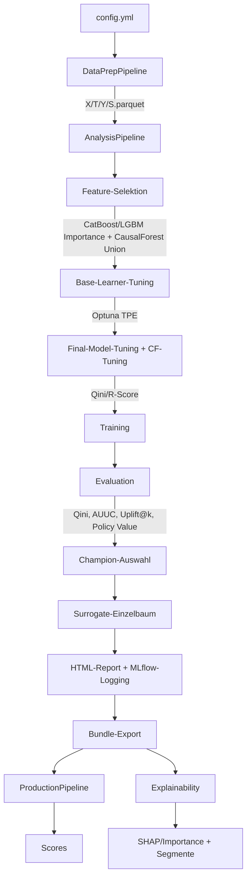

# Architektur

rubin ist ein modulares Python-Framework für kausale Modellierung (Causal ML). Die Architektur folgt vier Leitideen:

1. **Analyse ≠ Produktion** — Analyse darf experimentieren (Feature-Selektion, Tuning, Modellvergleich). Produktion bleibt stabil, reproduzierbar und frei von Trainingslogik.
2. **Artefakt-basierte Übergabe** — Alles, was Produktion braucht, wird beim Analyselauf synchron in ein Bundle exportiert.
3. **Strikte Konfiguration** — Eine YAML-Datei steuert das gesamte Verhalten, validiert mit Pydantic (`extra="forbid"`).
4. **Erweiterbarkeit über Registries** — Neue Modelle und Base-Learner werden zentral über Factory/Registry angebunden.


## Gesamtfluss




## DataPrepPipeline

Einmalige, reproduzierbare Aufbereitung von Rohdaten in standardisierte Parquet-Dateien.

**Eingabe:** Rohdaten (CSV, Parquet, SAS), optional Feature-Dictionary (Excel)

**Ablauf:**
- Einlesen (chunked, multi-file mit merge/treatment_only-Logik)
- Treatment-Balance-Prüfung bei mehreren Dateien (Warnung bei >5pp Unterschied, optionales Downsampling per `balance_treatments`)
- Optional: „Train Many, Evaluate Some" — Eval-Maske (`eval_mask.npy`) aus `eval_file_index` extrahieren
- Deduplizierung (optional: ein Eintrag pro Kunden-ID)
- Feature-Selektion: über Feature-Dictionary (Spalte ROLE = INPUT) falls vorhanden, sonst alle Spalten außer Target/Treatment
- Replacement-Maps, Fill-NA, Encoding, Speicherreduktion (Downcasting)
- Optional: Eval-Daten transformieren (`eval_data_path`) — Preprocessor wird nur auf Train gefittet, Eval-Daten werden nur transformiert (kein Leakage)

**Ausgabe:** `X.parquet`, `T.parquet`, `Y.parquet`, optional `S.parquet`, `eval_mask.npy`, `preprocessor.pkl`, `dtypes.json`, `schema.json`. Bei `eval_data_path`: zusätzlich `X_eval.parquet`, `T_eval.parquet`, `Y_eval.parquet`.

**MLflow-Logging (optional):** Bei `log_to_mlflow: true` wird ein eigener MLflow-Run erzeugt (Name: `Datenaufbereitung – <adjektiv>-<nomen>`). Experiment-Name und Run-Name werden als `.mlflow_experiment` und `.mlflow_run_name` im Output-Verzeichnis persistiert, damit die Analyse-Pipeline und die Web-UI sie automatisch übernehmen können. Die Web-UI liest diese über `GET /api/dataprep-info` und setzt den Experiment-Namen auf der Konfigurationsseite vor.

```bash
pixi run dataprep -- --config <CONFIG>
# oder: python run_dataprep.py --config <CONFIG>
```


## AnalysisPipeline

Training, Evaluation und optionaler Bundle-Export — der zentrale Workflow.

### Schritt 1: Daten laden
X, T, Y (optional S, optional eval_mask) aus Parquet/NPY. Optionales Downsampling (`df_frac`), Dtype-Alignment. Kategorische Spalten werden aus der Konfiguration oder den Datentypen wiederhergestellt. Historische Scores werden beim Laden auf NaN/Inf geprüft und durch 0 ersetzt; fehlt die S-Spalte in der Datei, wird eine Warnung geloggt statt eines Crashs. Zwei Validierungsmodi:
- `validate_on: cross` — Cross-Predictions (K-Fold) auf dem gleichen Datensatz (Standard). Kombinierbar mit einer Eval-Maske für „Train Many, Evaluate Some".
- `validate_on: external` — Training auf `data_files`, Evaluation auf separatem Datensatz (`eval_x/t/y_file`). Kein Data-Leakage, da der Preprocessor in der DataPrep nur auf Train gefittet wird.

**Alignment-Garantie:** Nach dem Laden wird X's Index auf 0-basiert zurückgesetzt (`reset_index`). Bei `df_frac`-Subsampling werden T, Y, S per label-basiertem `.loc[idx]` selektiert (gleiche Zeilen wie X). Die eval_mask nutzt `get_indexer` für positionssichere Indexierung. Assertions prüfen `len(X) == len(T) == len(Y)` (und S/eval_mask wenn vorhanden).

Bei `external` wird nach der Feature-Selektion ein Feature-Alignment auf die Eval-Daten angewendet (`reindex`), damit entfernte Features korrekt behandelt werden.

Die DataPrep-Konfiguration (`dataprep_config.yml`) wird automatisch nach MLflow mitgeloggt, sofern sie im Verzeichnis der Eingabedaten liegt.

### Schritt 2: Feature-Selektion (optional)
Vierstufiger Prozess:
1. **Importances berechnen** (auf ALLEN Features) — mehrere Methoden kombinierbar:
   - **catboost_importance**: CatBoost auf Outcome (Y), PredictionValuesChange-Importance (Default)
   - **lgbm_importance**: LightGBM auf Outcome (Y), Gain-Importance
   - **causal_forest**: GRF CausalForest Feature-Importances (kausale Heterogenität)
2. **Korrelationsfilter** (importance-gesteuert) — bei korrelierten Paaren (|r| > Schwellwert) wird das Feature mit der niedrigeren aggregierten Importance entfernt. Pearson zuerst, dann Spearman nur auf überlebenden Spalten.
3. **Importance-Umverteilung** — die Importance des entfernten Features wird auf den überlebenden Partner addiert, um das Importance-Splitting bei korrelierten Features zu korrigieren.
4. **Exaktes Feature-Budget** — pro Methode die Top-N der (korrigierten) Importances per Union, dann per Konsens-Rang auf exakt `max_features` kappen bzw. auffüllen.

Die LightGBM-Fits nutzen automatisch native kategoriale Splits (via `categorical_feature`-Patch). Die Methoden laufen sequentiell, aber jede nutzt alle CPU-Kerne. CausalForest subsampelt große Datensätze (>100k) automatisch stratifiziert nach Treatment. Bei Multi-Treatment wird T für GRF automatisch binarisiert (Control vs. Any Treatment). Globale Seeds (`np.random.seed`, `random.seed`) werden vor dem GRF-Fit gesetzt für maximale Reproduzierbarkeit.

### Schritt 3: Base-Learner-Tuning (optional)

Optimiert Nuisance-Modelle (Outcome, Propensity, Regression) über Optuna TPE mit signatur-basiertem Task-Sharing. Jeder Task wird als eigenständige Optuna-Study mit fester Metrik (log_loss für Klassifikation, neg_mse für Regression) und optionaler Overfit-Penalty evaluiert. Zusätzlich werden Skill Scores (Verbesserung gegenüber naivem Baseline-Modell) berechnet und geloggt. Details in `docs/tuning_optuna.md`.

**Kategorische Features und der `partialmethod`-Patch:** EconML konvertiert die Feature-Matrix `X` intern über sklearn's `check_array` zu einem numpy-Array. Dabei gehen pandas category-Dtypes verloren — LightGBM und CatBoost erhalten dann nur float64-Werte und nutzen ordinale statt kategoriale Splits (deutlich schwächere Modellierung bei nominalen Features). Der `patch_categorical_features()`-Context-Manager (`rubin/utils/categorical_patch.py`) löst das, indem er die `.fit()`-Methoden von `LGBMClassifier`, `LGBMRegressor`, `CatBoostClassifier` und `CatBoostRegressor` auf Klassen-Ebene mit `functools.partialmethod` patcht. Damit wird `categorical_feature=<indices>` (LightGBM) bzw. `cat_features=<indices>` (CatBoost) bei jedem `.fit()`-Aufruf automatisch übergeben — auch wenn EconML intern nur `model.fit(X_numpy, y)` aufruft. Die Spaltenindizes werden über `_detect_cat_indices()` aus den aktuellen category-/object-Spalten von X ermittelt. In der Pipeline gibt es zwei Patch-Kontexte: (1) Feature-Selektion — mit den Spaltenindizes vor FS, damit kategorische Features in der LightGBM-Importance nicht unterbewertet werden. (2) Tuning + Training + Evaluation + Surrogate + Refit — mit den Spaltenindizes nach FS. Der Patch wirkt auf Klassen-Ebene, d.h. alle Instanzen innerhalb des `with`-Blocks sind betroffen (inkl. Optuna-Trials, Cross-Prediction-Folds, DRTester-Nuisance, Surrogate-Bäume). Im `finally`-Block werden die Originale immer wiederhergestellt — kein globaler State-Leak.

### Schritt 4: Final-Model-Tuning & CausalForest-Tuning (optional)

**Final-Model-Tuning (FMT):** Optimiert die Hyperparameter von model_final (CATE-Effektmodell) per Optuna. Beide FMT-Modelle (NonParamDML, DRLearner) nutzen äußere OOF-CV mit QiniScorer (Default bei RCT) oder externem RScorer (Default bei obs., unabhängige Nuisance). Ohne FMT verwendet model_final ausschließlich LightGBM/CatBoost-Standardwerte.

CausalForestDML ist bewusst nicht Teil des FMT: Sein „model_final" ist der GRF-Forest selbst — keine LightGBM/CatBoost-Hyperparameter, die per Optuna tuned werden könnten. Die Wald-Parameter werden stattdessen über CFT (CausalForestTuner, Optuna TPE) optimiert.

**CausalForest-Tuning (CFT):** Optimiert 4 kausale Parameter (max_depth, min_weight_fraction_leaf, min_var_fraction_leaf, criterion) für CausalForestDML und CausalForest via Optuna TPE (aligniert mit EconML tune()). Restliche Wald-Parameter auf EconML-Defaults fixiert. Trials laufen sequentiell (n_jobs=1), Forest intern nutzt alle Kerne.

- **CausalForestDML:** Nuisance wird einmalig gecacht (`cache_values=True`). Trials ändern Forest-Parameter via `setattr()` + `refit_final()` (kein `set_params()` — CausalForestDML ist kein sklearn BaseEstimator). Bei RCT: `model_t = DummyClassifier(strategy="prior")` im Cache.
- **CausalForest:** Nuisance-Residuen einmalig vorberechnet. Pro Trial frischer `CausalForest(**params)` mit Params im Konstruktor.

#### Fairness der Hyperparameter-Selektion

Alle Tuning-Schritte (BL-Tuning, FMT, CF tune) verwenden den First-Fold-Training-Split (~80% der Daten) als Datenbasis. Die gefundenen Hyperparameter werden anschließend im finalen Training auf alle Daten angewendet.

Dieses Design stellt Fairness im Modellvergleich sicher:

1. **Holdout-Prinzip:** ~20% der Daten (erster Fold Val) werden von keinem Tuning-Schritt gesehen. Beim Training kommen diese Daten erstmals in den äußeren CV-Folds zum Einsatz — die Hyperparameter wurden nicht auf ihnen optimiert.
2. **FMT-Zielfunktion vs. Evaluationsmetrik:** FMT optimiert je nach Konfiguration den **Qini-Koeffizienten** (Default bei RCT — direkt auf Ranking-Qualität, identisch mit der Evaluationsmetrik) oder den **R-Score** (Default bei Beobachtungsdaten — normalisiert gegen Intercept-Only-Baseline, nicht identisch mit QINI/AUUC). Konfigurierbar über `scorer: auto|qini|rscore`.
3. **Konsistente Datenbasis:** Alle Tuning-Schritte nutzen denselben stratifizierten Split (identischer Seed, T×Y-Stratifizierung). BL-Tuning, FMT und CF tune sehen exakt dieselben Trainingszeilen.
4. **Kein struktureller Vorteil durch FMT:** Meta-Learner haben kein model_final → kein FMT nötig. CausalForestDML nutzt eigenes CFT (Optuna-basiertes Wald-Parameter-Tuning) statt FMT. CausalForest hat weder Nuisance noch model_final. Der Vergleich ist fair, da FMT ein inhärentes Feature der DML-Architektur ist — nicht ein Evaluations-Vorteil.
5. **Dual-Seed-System (Val-Set-Overfitting-Schutz):** Tuning-CV-Folds (`tuning_seed=18`) und Training/Evaluation-Folds (`SEED=42`) verwenden verschiedene Seeds. Dadurch werden die Hyperparameter auf anderen Fold-Grenzen evaluiert als beim Tuning, was Selection Bias verhindert. Dies ist ein recheneffizienter Ersatz für volle Nested CV (die K × n_trials zusätzliche Trials erfordern würde). Siehe `docs/tuning_optuna.md → Val-Set-Overfitting-Schutz` für Details.

### Schritt 5: Training

Alle Modelle durchlaufen externe K-Fold Cross-Validation. Für jede Beobachtung wird eine CATE-Prediction aus einem Modell erzeugt, das diese Beobachtung nicht gesehen hat (Out-of-Fold). Zusätzlich wird pro Fold auf dem gesamten Datensatz predictet (Fold-Aligned Predictions in `DataFrame.attrs["fold_aligned_preds"]`) für leakage-freies Surrogate-Training.

Bei RCT (`study_type: "rct"`) werden alle Propensity-Rollen (model_t, model_propensity, propensity_model) durch `DummyClassifier(strategy="prior")` ersetzt — konstante Propensity P(T|X) = mean(T).

DML/DR-Modelle (NonParamDML, ParamDML, CausalForestDML, DRLearner) nutzen zusätzlich internes Cross-Fitting für die Nuisance-Residualisierung innerhalb jedes äußeren Folds. Das interne Cross-Fitting erzeugt OOF-Nuisance-Residuals (Y_res, T_res), aber model_final trainiert auf allen Residuals des äußeren Trainings-Folds — ohne externe CV wären die CATE-Predictions daher nicht out-of-fold.

CausalForest-CV-Folds laufen immer sequentiell, da der interne GRF joblib-Prozesse für die Baum-Parallelisierung spawnt — in Threads führt das zu Deadlocks. Alle anderen Modelle können parallel über Folds verarbeitet werden.

### Schritt 5b: Ensemble (optional)
Bei `models.ensemble: true` und mindestens 2 trainierten Modellen wird ein gleichgewichtetes Ensemble (`EnsembleCateEstimator` aus EconML) erstellt. Die Ensemble-Predictions sind der Mittelwert der individuellen Out-of-Fold-Vorhersagen aller Modelle. Das Ensemble nimmt regulär an der Champion-Selektion teil. CausalForest ist über den `CausalForestAdapter` (`BaseCateEstimator`-kompatibel) vollwertig ensemble-fähig.

Wird das Ensemble Champion und `refit_champion_on_full_data: true`, werden beim Bundle-Export alle Modelle auf vollen Daten refittet. Anschließend wird ein neues `EnsembleCateEstimator` mit allen gefitteten Modellen erstellt.

Für Explainability wird bei einem Ensemble-Champion automatisch das beste Einzelmodell (nach Selektionsmetrik) herangezogen, da `EnsembleCateEstimator` kein natives SHAP unterstützt.

### Schritt 6: Evaluation
Die Evaluation läuft in drei Phasen:

1. **Schnelle Metriken + CATE-Verteilung (alle Modelle):** Qini, AUUC, Uplift@10/20/50%, Policy Value — reines NumPy, <1s pro Modell. Grundlage für Champion-Selektion (nur trainierte Modelle, historischer Score ausgeschlossen). CATE-Verteilungs-Histogramme (Training + Cross-Validated) zeigen die Effektverteilung pro Modell.
2. **DRTester-Diagnostik (Level-abhängig):** Calibration, Qini/TOC mit Bootstrap-CIs. Nuisance-Modelle nutzen leichtere Varianten (n_estimators≤100, cv=5) für schnelleres Fitting. Level 1–2: alle Modelle, Level 3: Champion + Challenger, Level 4: nur Champion. Jeder Sub-Test (BLP, Cal, Qini, TOC) läuft in einem eigenen try/except — wenn BLP crasht, werden Qini/TOC und Policy Values trotzdem berechnet.
3. **Uplift-Plots (alle Modelle):** Qini-Kurve, Uplift-by-Percentile, Treatment-Balance, Score-Redistribution (wenn historischer Score vorhanden), Custom Qini vs. Historisch — immer für alle Modelle, da schnell (~2-5s). Alle Plots sind native rubin-Implementierungen mit rubin-Farbpalette.

Optional: Vergleich gegen historischen Score (Policy-Value-Comparison als letzter Schritt, nachdem alle Modell- und Historical-Policy-Values berechnet sind). Bei MT werden die DRTester-Nuisance-Fits pro Arm bei Level 3–4 parallel ausgeführt. Bei aktiver Eval-Maske (`eval_mask_file`) werden die Metriken und DRTester-Plots nur auf den markierten Zeilen berechnet, Evaluation wird nur auf den Mask-Zeilen berechnet, Training auf allen Daten (Train Many, Evaluate Some). Der pre-fitted DRTester (`fitted_tester_bt`) wird aus `_run_evaluation` an `run()` zurückgegeben und für den Surrogate-Block wiederverwendet.

### Schritt 7: Surrogate-Einzelbaum
rubin trainiert einen Surrogate-Einzelbaum wenn `surrogate_tree.enabled: true`. Der Surrogate nutzt **Fold-Aligned Predictions** für komplett leakage-freies Training:

- **K-Fold CV (Evaluation):** Für Surrogate-Fold k wird Champion_k's Prediction als Target verwendet. Champion_k hat Fold k nie gesehen → kein Informationspfad von Val-Samples ins Training. Ensemble-Champion: Fold-Aligned aus Einzelmodellen gemittelt.
- **Final-Fit (Produktion):** Trainiert auf Full-Data-Refit-Predictions des Champions (weniger Rauschen, keine Evaluation darauf).
- **Volle Evaluation:** Metriken, DRTester (BLP, Calibration, Qini/TOC-CIs, Policy Values), Uplift-Plots, Score-Redistribution, Custom Qini — identisch zum Champion.

Der Surrogate nutzt LightGBM oder CatBoost mit `n_estimators=1`. Bei Multi-Treatment wird pro Arm ein separater Baum erzeugt.

### Schritt 8: Champion-Auswahl + Bundle-Export
Bestes Modell anhand der konfigurierten Metrik (Standard: Qini). Optional manuell festlegbar. Bei `refit_champion_on_full_data: true` wird der Champion vor dem Export auf allen Daten refittet. Sonderfall Ensemble: Alle Einzelmodelle werden refittet, dann wird ein neues `EnsembleCateEstimator` mit den refitteten Modellen erstellt. Bundle-Export schreibt alle Production-Artefakte synchron.

### Schritt 9: Explainability
Bei `shap_values.calculate_shap_values: true`: SHAP-Werte und Importance-Plots für den Champion. SHAP-Werte werden auf Out-of-Sample-Daten berechnet (CV: letztes Fold-Modell + Out-of-Fold-Samples, External: Eval-Daten). Artefakte werden als MLflow-Artefakte geloggt und in den HTML-Report eingebettet.

### Schritt 10: HTML-Report
Am Ende wird automatisch ein `analysis_report.html` erzeugt — ein selbstständiger Report mit Datengrundlage, Config-Zusammenfassung, Tuning-Güte, Modellvergleich (Champion hervorgehoben), Diagnose-Plots pro Modell mit Erklärungstexten, Surrogate-Vergleich und optionaler Explainability-Sektion. Alle Plots sind klickbar und öffnen eine Lightbox-Vergrößerung. Der Report wird in `.rubin_cache/` (für die App) und als MLflow-Artefakt gespeichert, optional zusätzlich in `output_dir`. Der Report wird nie ins Projektverzeichnis geschrieben.

Der Report unterscheidet im Config-Overview die drei Validierungsmodi automatisch:
- **`"cross (5 Folds)"`** bei reinem Cross-Validation ohne Eval-Maske
- **`"external (separater Datensatz)"`** bei `validate_on: external` mit separaten Eval-Dateien
- **`"TMES (Mask-Subset)"`** bei gesetztem `eval_mask_file` — die Summary-Bar zeigt zusätzlich `"Eval (TMES): N Beob."` mit der Eval-Subset-Größe

```bash
pixi run analyze -- --config <CONFIG> --export-bundle --bundle-dir bundles
# oder: python run_analysis.py --config <CONFIG> [--export-bundle --bundle-dir bundles]
```


## Bundles

Ein Bundle ist ein Verzeichnis mit allen Artefakten für reproduzierbares Scoring:

| Datei | Beschreibung |
|---|---|
| `config_snapshot.yml` | Verwendete Konfiguration |
| `preprocessor.pkl` | Transformationslogik (Feature-Reihenfolge, Dtypes, Encoding) |
| `models/*.pkl` | Trainierte Modelle (Champion + Challenger) |
| `model_registry.json` | Champion/Challenger-Manifest mit Metriken |
| `schema.json` | Feature-Schema (erwartete Spalten, Typen) |
| `dtypes.json` | Referenz-Datentypen |
| `metadata.json` | Erstellungszeit, Refit-Info, Feature-Spalten |
| `SurrogateTree.pkl` | Optional: interpretierbarer Einzelbaum |


## ProductionPipeline

Stabiles, reproduzierbares Scoring auf neuen Daten — ohne Training, Tuning oder Feature-Selektion.

**Ablauf:** Preprocessor laden → Dtype-Alignment → Schema-Check → Transform → Scoring → Output

**Scoring-Optionen:**
- Champion (Standard) aus `model_registry.json`
- Spezifisches Modell: `--model-name NonParamDML`
- Alle Modelle: `--use-all-models`
- Surrogate-Einzelbaum: `--use-surrogate`

```bash
pixi run score -- --bundle <BUNDLE> --x <DATEI> --out scores.csv
# oder: python run_production.py --bundle <BUNDLE> --x <DATEI> --out scores.csv
```


## Explainability

Separater Runner, damit Analyse und Production schlank bleiben.

**Methoden:**
- **SHAP** (Standard): Modellagnostische SHAP-Werte für f(X) = CATE(X)


**Fehlende Werte:** Alle Modelle außer CausalForestDML und CausalForest können mit fehlenden Werten umgehen,
da sie LightGBM oder CatBoost als Base Learner nutzen. CausalForestDML und CausalForest basieren intern auf
einem GRF (Generalized Random Forest), der keine fehlenden Werte unterstützt. Bei fehlenden
Werten in den Daten werden beide automatisch übersprungen. Gleiches gilt für die
Feature-Selektionsmethode `causal_forest` (GRF).


## Multi-Treatment

rubin unterstützt neben Binary Treatment (T ∈ {0,1}) auch Multi-Treatment (T ∈ {0,1,…,K-1}):

| Aspekt | Binary Treatment | Multi-Treatment |
|---|---|---|
| CATE-Output | 1 Wert (n,) | K-1 Werte (n, K-1) |
| Modelle | Alle 8 (inkl. CausalForest) | DML-Familie + DRLearner (4) |
| Evaluation | Qini, AUUC, Uplift@k, PV | Pro-Arm-Metriken + per-Arm PV + globaler Policy Value (IPW) |
| Champion-Metrik | `qini` (empfohlen) | `policy_value` (empfohlen), alternativ `policy_value_T1`, `qini_T1` etc. |
| Propensity-Tuning | log_loss (binär) | log_loss (Multiclass, automatisch) |
| Production-Output | `cate_<M>` | `cate_<M>_T1…`, `optimal_treatment`, `confidence` |
| Surrogate | 1 Baum | 1 Baum pro Arm |
| Explainability | SHAP auf CATE(X) | SHAP auf max(τ_k(X)) |
| Hist. Score-Vergleich | ✓ | ✗ |

BT ist ein Spezialfall von MT (K=2). Im Code wird das (n,1)-Array zum (n,)-Array gequetscht — derselbe Codepfad. Nur bei Plots, Reports und Policy-Zuweisung gibt es eine MT-Verzweigung.

## CPU-Parallelisierung: n_jobs / parallel_jobs Architektur

### Grundprinzip

Zwei getrennte Steuerungsparameter:

- **`n_jobs`**: Steuert die Parallelisierung innerhalb eines Estimators (z.B. Baumbildung bei CausalForest, interne Cross-Fitting-Folds bei EconML).
- **`parallel_jobs`**: Steuert die Kerne pro Base-Learner-Fit (CatBoost `thread_count`, LightGBM `n_jobs`).

Die zentrale Regel: **Gesamtauslastung ≈ verfügbare Kerne**. Wenn mehrere Fits parallel laufen (BLT), bekommt jeder weniger Kerne. Wenn Fits sequentiell laufen (FMT, CFT, FS, Training von CausalForest), bekommt jeder alle Kerne.

### Parallelisierungs-Level (constants.parallel_level)

| Level | BLT parallel_jobs | BLT Trials parallel | FMT/CFT parallel_jobs | FMT/CFT Trials | Training Folds |
|-------|-------------------|---------------------|-----------------------|----------------|----------------|
| 1     | 1                 | 1                   | -1 (alle)             | 1 (sequentiell, cache_values) | sequentiell    |
| 2     | -1 (alle)         | 1                   | -1 (alle)             | 1 (sequentiell, cache_values) | sequentiell    |
| 3     | cores/workers     | cores//4            | -1 (alle)             | 1 (sequentiell, cache_values) | parallel       |
| 4     | cores/workers     | cores//4            | -1 (alle)             | 1 (sequentiell, cache_values) | parallel (max) |

### CFT: CPU-Parallelisierung bei CFDML und GRF

`CausalForestDML(n_jobs=-1)` parallelisiert den **CausalForest-Baum-Fit**. Die Nuisance-Cross-Fitting-Schleife (model_y, model_t pro Fold) ist in EconML's `_OrthoLearner` **sequentiell** (nur mit `use_ray=True` parallelisierbar, das wir nicht verwenden). Deshalb ist `parallel_jobs=-1` für die Nuisance-Modelle sicher und korrekt — zu jedem Zeitpunkt fittet nur EIN model_y oder model_t.

```
CausalForestDML(n_jobs=-1, model_y=CatBoost(thread_count=-1)):
  Phase 1 — Nuisance (K Folds SEQUENTIELL):
    Fold 1: model_y.fit() → alle CPUs  ──┐
            model_t.fit() → alle CPUs    │ nacheinander
    Fold 2: model_y.fit() → alle CPUs    │ (kein ray)
            model_t.fit() → alle CPUs  ──┘
  Phase 2 — Forest (alle CPUs):
    CausalForest.fit(residuals) → alle CPUs
```

**Standalone Nuisance-Fits** (GRF Residuen-Vorberechnung vor dem Optuna-Loop) laufen ebenfalls sequentiell mit `parallel_jobs=-1`.

```
CausalForestTuner.tune():
  ┌─ GRF Residuen-Vorberechnung (VOR Optuna) ─┐
  │  model_y.fit()  → parallel_jobs=-1  (alle CPUs)
  │  model_t.fit()  → parallel_jobs=-1  (alle CPUs)
  └────────────────────────────────────────────┘
  
  ┌─ Optuna study.optimize (n_jobs=1, sequentiell) ─┐
  │  Trial N:                                        │
  │    CausalForestDML(                              │
  │      model_y → parallel_jobs=-1  (alle CPUs)     │
  │      model_t → parallel_jobs=-1  (alle CPUs)     │
  │      n_jobs=-1  (Forest nutzt alle CPUs)          │
  │    )                                             │
  │  ─── ODER ───                                    │
  │    CausalForest(                                 │
  │      n_jobs=-1  (Forest nutzt alle CPUs)          │
  │    )                                             │
  └──────────────────────────────────────────────────┘
```

### CausalForest in Training (analysis_pipeline.py)

Bei CausalForestDML und CausalForest wird `ctx.parallel_jobs` explizit auf `-1` überschrieben (Zeilen 821, 833), unabhängig vom berechneten `pj` für andere Modelle. Grund: CausalForest-Folds laufen immer sequentiell (GRF spawnt intern joblib-Prozesse → fork-aus-Thread → Deadlock). Da kein Fold-Parallelismus stattfindet, sind alle Kerne für den einzelnen Forest verfügbar.

### Feature Selection

Feature-Importance-Methoden laufen immer sequentiell (auch bei Level 3/4), da CausalForest-GRF intern joblib-Prozesse spawnt. Jede Methode bekommt `n_jobs=-1` (alle Kerne). Bei `parallel_level=1` wird `n_jobs=1` erzwungen.

### Warum FMT/CFT sequentiell (n_jobs=1)

FMT und CFT nutzen `cache_values=True`: Die Nuisance-Modelle werden einmalig pro äußerem Fold gecacht, danach fitten Trials nur noch `model_final` via `refit_final()`. Da `refit_final()` den gecachten Estimator in-place modifiziert, ist parallele Trial-Ausführung nicht thread-safe. Die sequentielle Ausführung ist trotzdem schnell, weil die Nuisance-Phase (~80% der Laufzeit) komplett entfällt. Jeder `refit_final()`-Aufruf und der Scorer (QiniScorer oder RScorer) nutzen alle Kerne (`parallel_jobs=-1`).
